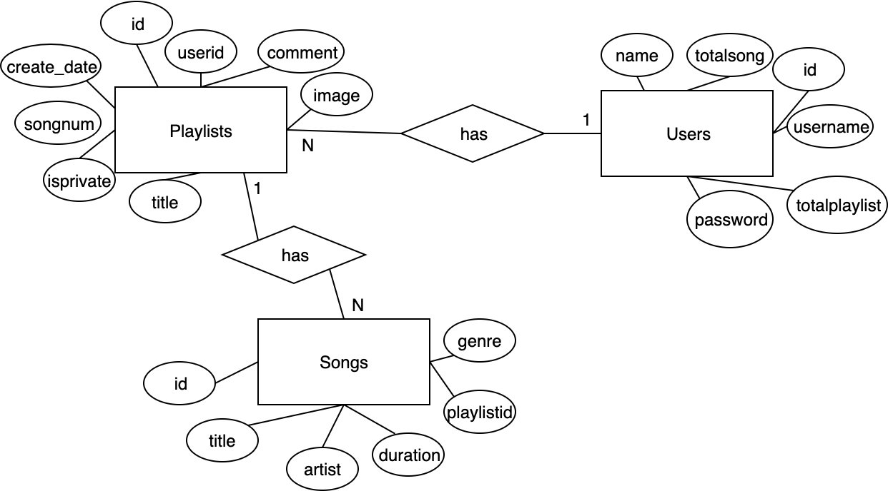

Developer Guide
===============

Database Design
---------------

Users create playlists and playlists have songs. 

Code
----

.. code-block:: python
	INIT_STATEMENTS = [
	    '''CREATE TABLE IF NOT EXISTS users(
	        name varchar(25), 
	        id SERIAL, 
	        username varchar(25), 
	        password varchar(100),
	        totalplaylist INTEGER DEFAULT 0, 
	        totalsong INTEGER DEFAULT 0, 
	        PRIMARY KEY (id)
	    )''',
	    '''CREATE TABLE IF NOT EXISTS playlists(
	        id SERIAL,
	        userid INTEGER REFERENCES users(id),
	        comment text,
	        create_date timestamp without time zone DEFAULT CURRENT_TIMESTAMP,
	        songnum integer DEFAULT 0,
	        isprivate integer,
	        title varchar(50),
	        PRIMARY KEY (id),
	        image bytea
	    )''',
	    '''CREATE TABLE IF NOT EXISTS songs(
	        id SERIAL,
	        title varchar(50),
	        artist varchar(50),
	        duration varchar(5),
	        playlistid INTEGER REFERENCES playlists(id),
	        genre varchar(10),
	        PRIMARY KEY (id)
	    )'''
	]
These statements are run in dbinit.py to initialize database in first run.

.. code-block:: python
	from flask import Flask
	from views import *

	app = Flask(__name__)
	app.secret_key = 'hello'

	app.add_url_rule("/", view_func=home)
	app.add_url_rule("/playlist/<string:id>", view_func=playlist)
	app.add_url_rule("/register", view_func=register, methods=["GET", "POST"])
	app.add_url_rule("/login", view_func=login, methods=["GET", "POST"])
	app.add_url_rule("/dashboard", view_func=dashboard)
	app.add_url_rule("/create_playlist", view_func=create_playlist, methods=["GET", "POST"])
	app.add_url_rule("/edit_playlist/<string:id>", view_func=edit_playlist, methods=["GET", "POST"])
	app.add_url_rule("/delete_playlist/<string:id>", view_func=delete_playlist)
	app.add_url_rule("/add_song/<string:id>", view_func=add_song, methods=["GET", "POST"])
	app.add_url_rule("/edit_song/<string:id>", view_func=edit_song, methods=["GET", "POST"])
	app.add_url_rule("/logout", view_func=logout)
	app.add_url_rule("/edit_playlist_info/<string:id>", view_func=edit_playlist_info, methods=["GET", "POST"])
	app.add_url_rule("/profile", view_func=profile, methods=["GET", "POST"])
	app.add_url_rule("/delete_user", view_func=delete_user, methods=["GET", "POST"])

	if __name__ == '__main__':
	    app.run(debug=True)
server.py - This is main python code. It runs server and has url rules. When a request comes from certain link, it tells what function will be called. 

.. code-block:: python
	import base64
	import imghdr
	from flask import render_template, request, session, redirect, url_for, flash
	from data import Database
	from forms import RegisterForm, PlaylistForm, SongForm, UpdateUser
	from functools import wraps
	from user import User
	from passlib.hash import sha256_crypt

	# initialize database class
	db = Database()

	# home page
	def home():
	    playlists = db.get_public_playlists()
	    return render_template('home.html', playlists=playlists)

	def user_check(playlistid):
	    playlist = db.get_playlist(playlistid)
	    if playlist is None or not ('logged_in' in session):
	        return False
	    elif playlist['userid'] == session['id']:
	        return True
	    else:
	        return False

	def is_logged_in(f):
	    @wraps(f)
	    def wrap(*args, **kwargs):
	        if 'logged_in' in session:
	            return f(*args, **kwargs)
	        else:
	            flash('You need to login', 'danger')
	            return redirect(url_for('login'))

	    return wrap

	def register():
	    form = RegisterForm(request.form)
	    if request.method == 'POST' and form.validate():
	        user = User()
	        user.name = form.name.data
	        user.username = form.username.data
	        user.password = sha256_crypt.encrypt(str(form.password.data))
	        username_check = db.get_user(user.username)
	        if username_check is not None:
	            return render_template('register.html', form=form, error="User already exists")
	        db.add_user(user)
	        flash("You are now registered.", "success")
	        return redirect('/login')

	    return render_template('register.html', form=form)

	def login():
	    if request.method == 'POST':
	        user = User()
	        user.username = request.form['username']
	        user.password_candidate = request.form['password']
	        result = db.get_user(user.username)

	        if result:
	            password = result['password']
	            if sha256_crypt.verify(user.password_candidate, password):
	                # passed login
	                session['logged_in'] = True
	                session['username'] = user.username
	                session['name'] = result['name']
	                session['id'] = result['id']
	                flash('You are now logged in', 'success')
	                return redirect(url_for('dashboard'))
	            else:
	                error = "Invalid password"
	                return render_template('login.html', error=error)

	        else:
	            error = "Username not found"
	            return render_template('login.html', error=error)

	    return render_template('login.html')

	# playlist page
	def playlist(id):
	    playlist = db.get_playlist(id)
	    if playlist is None:
	        playlists = db.get_public_playlists()
	        return render_template('home.html', error="Playlist not found", playlists=playlists)
	    songs = db.get_songs(id)
	    userid = playlist['userid']
	    user = db.get_user(id=userid)
	    username = user['username']
	    if playlist['image']:
	        image = playlist['image']
	        playlist['image'] = base64.b64encode(image)
	        playlist['image'] = playlist['image'].decode('utf-8')
	    if int(playlist['isprivate']) and (not user_check(id)):
	        return render_template('home.html', error="This playlist is private")
	    if songs:
	        return render_template('/playlist.html', songs=songs, playlist=playlist, username=username)
	    else:
	        msg = "Looks like there is no song in this playlist"
	        return render_template('/playlist.html', msg=msg, playlist=playlist, username=username)

	# dashboard page
	@is_logged_in
	def dashboard():
	    playlists = db.get_playlists(session['id'])
	    if playlists:
	        return render_template('dashboard.html', playlists=playlists)
	    else:
	        msg = "Looks like you don't have a playlist"
	        return render_template('dashboard.html', msg=msg)

	# create playlist page
	@is_logged_in
	def create_playlist():
	    form = PlaylistForm(request.form)
	    if request.method == 'POST' and form.validate():
	        title = form.title.data
	        comment = form.comment.data
	        userid = session['id']
	        if request.form.get("isprivate") == "1":
	            isprivate = 1
	        else:
	            isprivate = 0
	        if request.files["inputFile"]:
	            file = request.files["inputFile"]
	            if(imghdr.what(file) is not None):
	                f = file.read()
	                db.create_playlist(title, comment, userid, isprivate, image=f)
	            else:
	                return render_template('create_playlist.html', form=form, error="Only images are accepted")
	        else:
	            db.create_playlist(title, comment, userid, isprivate)
	        flash('Playlist created', 'success')
	        return redirect(url_for('dashboard'))
	    return render_template('create_playlist.html', form=form)

	# edit playlist page
	@is_logged_in
	def edit_playlist(id):
	    if not user_check(id):
	        playlists = db.get_public_playlists()
	        error = "You are not allowed to do this command."
	        return render_template('home.html', error=error, playlists=playlists)
	    playlist = db.get_playlist(id)
	    songs = db.get_songs(id)
	    if songs:
	        if request.method == "POST":
	            form_song_ids = request.form.getlist("song_ids")
	            for form_song_id in form_song_ids:
	                db.delete_song(form_song_id, id)
	            return redirect(url_for('edit_playlist', id=id))
	        return render_template('/edit_playlist.html', songs=songs, playlist=playlist)
	    else:
	        msg = "Looks like you don't have a song in this playlist"
	        return render_template('edit_playlist.html', msg=msg, playlist=playlist)

	@is_logged_in
	def profile():
	    form = UpdateUser(request.form)
	    form.name.data = session['name']
	    form.username.data = session['username']
	    user = db.get_user(session['username'])
	    totalsong = db.total_song(session['id'])[0]
	    if totalsong is None:
	        totalsong = 0
	    totalplaylist = user['totalplaylist']
	    if request.method == 'POST' and form.validate():
	        if request.form['password'] != "":
	            password = sha256_crypt.encrypt(str(request.form['password']))
	        else:
	            password = None

	        if request.form['name'] == "":
	            name = None
	        else:
	            name = request.form['name']

	        if (name is None or name == session['name']) and password is None:
	            return render_template('profile.html', form=form, totalplaylist=totalplaylist, totalsong=totalsong,
	                                   msg="Nothing changed")
	        id = session['id']
	        db.update_user(id, name=name, password=password)
	        session['name'] = name
	        flash("Successfully updated", 'success')
	        return redirect(url_for('dashboard'))
	    return render_template("profile.html", form=form, totalplaylist=totalplaylist, totalsong=totalsong, )

	@is_logged_in
	def delete_user():
	    form = RegisterForm()
	    if request.method == 'POST':
	        userid = session['id']
	        password_candidate = request.form['password']
	        user = db.get_user(session['username'])
	        if sha256_crypt.verify(password_candidate, user['password']):
	            db.delete_user(userid)
	            session.clear()
	            flash("Your account successfully deleted", "success")
	            return redirect(url_for('login'))
	        else:
	            flash("Wrong password", "danger")
	            return redirect(url_for('delete_user'))
	    return render_template("delete_user.html", form=form)

	@is_logged_in
	def edit_playlist_info(id):
	    if not user_check(id):
	        playlists = db.get_public_playlists()
	        error = "You are not allowed to do this command."
	        return render_template('home.html', error=error, playlists=playlists)
	    playlist = db.get_playlist(id)
	    form = PlaylistForm(request.form)
	    form.title.data = playlist['title']
	    form.comment.data = playlist['comment']
	    checked = playlist['isprivate']
	    if request.method == 'POST' and form.validate():
	        title = request.form['title']
	        comment = request.form['comment']
	        if request.form.get("isprivate") == "1":
	            isprivate = 1
	        else:
	            isprivate = 0
	        if request.files["inputFile"]:
	            file = request.files["inputFile"]
	            if imghdr.what(file) is not None:
	                f = file.read()
	                db.update_playlist(id, title, comment, isprivate, image=f)
	            else:
	                return render_template('/edit_playlist_info.html', form=form, error="Only images are accepted", checked=checked)

	        db.update_playlist(id, title, comment, isprivate)
	        flash('Playlist updated', 'success')
	        return redirect(url_for('edit_playlist', id=id))

	    return render_template('/edit_playlist_info.html', form=form, checked=checked)

	# delete playlist func
	@is_logged_in
	def delete_playlist(id):
	    if not user_check(id):
	        playlists = db.get_public_playlists()
	        error = "You are not allowed to do this command."
	        return render_template('home.html', error=error, playlists=playlists)
	    db.delete_playlist(id)
	    flash('Playlist deleted', 'success')
	    return redirect(url_for('dashboard'))

	# add song page
	@is_logged_in
	def add_song(id):
	    if not user_check(id):
	        playlists = db.get_public_playlists()
	        error = "You are not allowed to do this command."
	        return render_template('home.html', error=error, playlists=playlists)
	    form = SongForm(request.form)
	    if request.method == 'POST' and form.validate():
	        title = form.title.data
	        artist = form.artist.data
	        genre = form.genre.data
	        duration = form.duration.data
	        db.add_song(title, artist, genre, duration, id)
	        flash('Song added', 'success')
	        return redirect(url_for('edit_playlist', id=id))
	    return render_template('add_song.html', form=form)

	# edit song page
	@is_logged_in
	def edit_song(id):
	    song = db.get_song(id)
	    if (song is None) or (not user_check(song['playlistid'])):
	        playlists = db.get_public_playlists()
	        error = "You are not allowed to do this command."
	        return render_template('home.html', error=error, playlists=playlists)
	    form = SongForm(request.form)
	    form.title.data = song['title']
	    form.artist.data = song['artist']
	    form.genre.data = song['genre']
	    form.duration.data = song['duration']

	    if request.method == "POST" and form.validate():
	        title = request.form['title']
	        artist = request.form['artist']
	        genre = request.form['genre']
	        duration = request.form['duration']
	        db.update_song(title, artist, genre, duration, id)
	        flash('Song updated', 'success')
	        return redirect(url_for('edit_playlist', id=song['playlistid']))

	    return render_template('edit_song.html', form=form)

	# logout func
	@is_logged_in
	def logout():
	    session.clear()
	    flash('You have been successfully logged out', 'success')
	    return redirect(url_for('login'))
views.py - This is where all view functions defined. View functions create pages. 

.. code-block:: python
	import psycopg2
	import psycopg2.extras

	class Database:

	    def __init__(self, dbname="d7a5dl9hnei5sp", user="aqqfheodautezc",
	                 password="579a54a9c7f0b81df63811b9c7829d946b2bbb04d5e6917b4ddccaa536f430dc",
	                 host="ec2-54-246-100-246.eu-west-1.compute.amazonaws.com"):
	        self.con = psycopg2.connect(database=dbname, user=user, password=password, host=host)
	        self.cur = self.con.cursor()

	    def add_user(self, user):
	        with self.con as conn:
	            cursor = conn.cursor()
	            query = "INSERT INTO users (name, username, password) VALUES (%s, %s, %s)"
	            cursor.execute(query, (user.name, user.username, user.password))
	            conn.commit()

	    def get_user(self, username=None, id=None):
	        if id is not None:
	            with self.con.cursor(cursor_factory=psycopg2.extras.DictCursor) as cursor:
	                query = "SELECT * FROM users WHERE id = %s"
	                cursor.execute(query, [id])
	                result = cursor.fetchone()
	            return result
	        else:
	            with self.con.cursor(cursor_factory=psycopg2.extras.DictCursor) as cursor:
	                query = "SELECT * FROM users WHERE username = %s"
	                cursor.execute(query, [username])
	                result = cursor.fetchone()
	            return result

	    def delete_user(self, id):
	        with self.con as conn:
	            cursor = conn.cursor()
	            playlists = self.get_playlists(id)
	            for playlist in playlists:
	                self.delete_playlist(playlist['id'])
	            query = "DELETE from users WHERE id=%s"
	            cursor.execute(query, [id])
	            conn.commit()

	    def get_songs(self, playlistid):
	        with self.con.cursor(cursor_factory=psycopg2.extras.DictCursor) as cursor:
	            query = "SELECT * FROM songs WHERE playlistid = %s"
	            cursor.execute(query, [playlistid])
	            songs = cursor.fetchall()
	        return songs

	    def get_playlist(self, id):
	        if not str(id).isdigit():
	            return None
	        with self.con.cursor(cursor_factory=psycopg2.extras.DictCursor) as cursor:
	            query = "SELECT * FROM playlists WHERE id = %s"
	            cursor.execute(query, [id])
	            playlist = cursor.fetchone()
	        return playlist

	    def get_playlists(self, userid):
	        with self.con.cursor(cursor_factory=psycopg2.extras.DictCursor) as cursor:
	            query = "SELECT * FROM playlists WHERE userid = %s"
	            cursor.execute(query, [userid])
	            playlists = cursor.fetchall()
	        return playlists

	    def get_public_playlists(self):
	        with self.con.cursor(cursor_factory=psycopg2.extras.DictCursor) as cursor:
	            query = "SELECT * FROM playlists WHERE (isprivate = 0) ORDER BY id DESC LIMIT 10"
	            cursor.execute(query)
	            playlists = cursor.fetchall()
	        return playlists

	    def create_playlist(self, title, comment, userid, isprivate, image=None):
	        with self.con as conn:
	            cursor = conn.cursor()
	            query = "INSERT INTO playlists(title, comment, userid, isprivate, image) VALUES(%s, %s, %s, %s, %s) RETURNING id"
	            cursor.execute(query, (title, comment, userid, isprivate, image))
	            query2 = "UPDATE users SET totalplaylist=totalplaylist+1 WHERE id=%s"
	            cursor.execute(query2, [userid])
	            conn.commit()

	    def update_playlist(self, playlistid, title, comment, isprivate, image=None):
	        with self.con.cursor(cursor_factory=psycopg2.extras.DictCursor) as cursor:
	            if image is not None:
	                query = 'UPDATE playlists SET title=%s, comment=%s, isprivate=%s, image=%s WHERE id = %s'
	                cursor.execute(query, (title, comment, isprivate, image, playlistid))
	            else:
	                query = 'UPDATE playlists SET title=%s, comment=%s, isprivate=%s WHERE id = %s'
	                cursor.execute(query, (title, comment, isprivate, playlistid))
	            self.con.commit()

	    def update_user(self, id, name=None, password=None):
	        with self.con.cursor() as cursor:
	            if name is not None:
	                    query = "UPDATE users SET name=%s WHERE id=%s"
	                    cursor.execute(query, (name, id))
	            if password is not None:
	                    query = "UPDATE users SET password=%s WHERE id=%s"
	                    cursor.execute(query, (password, id))
	            self.con.commit()

	    def delete_song(self, songid, playlistid):
	        with self.con as conn:
	            cursor = conn.cursor()
	            query = "DELETE FROM songs WHERE id = %s"
	            cursor.execute(query, [songid])
	            query2 = "UPDATE playlists set songnum = songnum - 1 WHERE id = %s"
	            cursor.execute(query2, [playlistid])
	            conn.commit()

	    def delete_playlist(self, playlistid):
	        with self.con as conn:
	            cursor = conn.cursor()
	            delete_songs = "DELETE FROM songs where playlistid = %s"
	            cursor.execute(delete_songs, [playlistid])
	            delete_playlist = "DELETE FROM playlists where id = %s"
	            cursor.execute(delete_playlist, [playlistid])
	            get_userid = "SELECT userid FROM playlists WHERE id=%s"
	            cursor.execute(get_userid, [playlistid])
	            userid = cursor.fetchone()
	            query2 = "UPDATE users SET totalplaylist=totalplaylist-1 WHERE id = %s"
	            cursor.execute(query2, [userid])
	            conn.commit()

	    def add_song(self, title, artist, genre, duration, playlistid):
	        with self.con as conn:
	            cursor = conn.cursor()
	            query = "INSERT INTO songs(title, artist, genre, duration, playlistid) VALUES(%s, %s, %s, %s, %s)"
	            cursor.execute(query, (title, artist, genre, duration, playlistid))
	            query2 = "UPDATE playlists set songnum = songnum + 1 WHERE id = %s"
	            cursor.execute(query2, [playlistid])
	            conn.commit()

	    def get_song(self, songid):
	        if not str(songid).isdigit():
	            return None
	        with self.con.cursor(cursor_factory=psycopg2.extras.DictCursor) as cursor:
	            query = 'SELECT * FROM songs WHERE id = %s'
	            cursor.execute(query, [songid])
	            song = cursor.fetchone()
	        return song

	    def update_song(self, title, artist, genre, duration, songid):
	        with self.con as conn:
	            cursor = conn.cursor()
	            query = 'UPDATE songs SET title=%s, artist=%s, genre=%s, duration=%s WHERE id=%s'
	            cursor.execute(query, (title, artist, genre, duration, songid))
	            conn.commit()

	    def total_song(self, userid):
	        with self.con as conn:
	            cursor = conn.cursor()
	            query = 'SELECT sum(songnum) FROM playlists WHERE userid=%s'
	            cursor.execute(query, [userid])
	            result = cursor.fetchone()
	            query2 = "UPDATE users SET totalsong=%s WHERE id=%s"
	            cursor.execute(query2, [result, userid])
	            conn.commit()
	        return result

	    def get_img(self, playlistid):
	        with self.con as conn:
	            cursor = conn.cursor()
	            query = 'SELECT images from images WHERE playlistid=%s'
	            cursor.execute(query, [playlistid])
	            result = cursor.fetchone()
	            result = result[0]
	            return result
data.py - This file has database functions. When there is a need in views functions to update, insert or delete database, these functions are called. psycopg2 library is used to connect heroku postgresql database. 

.. toctree::

   member1
  
