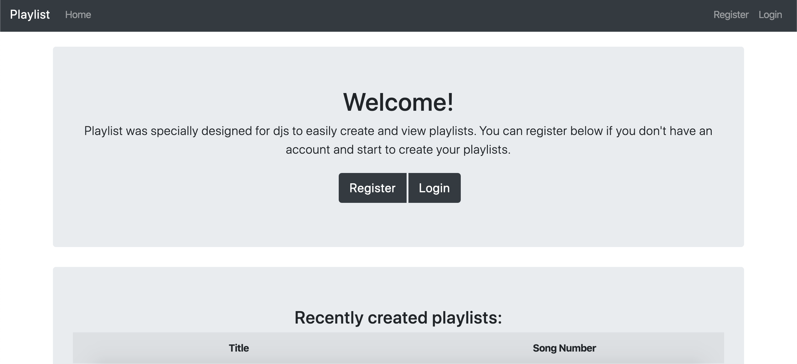
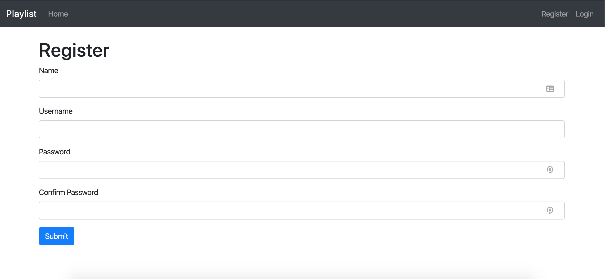
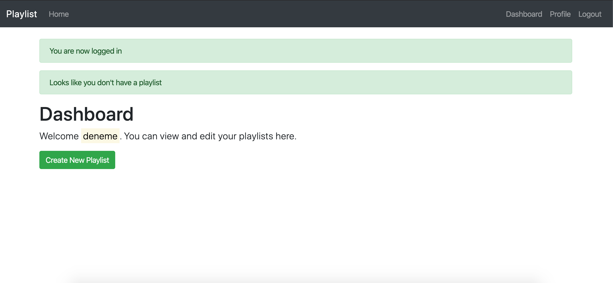
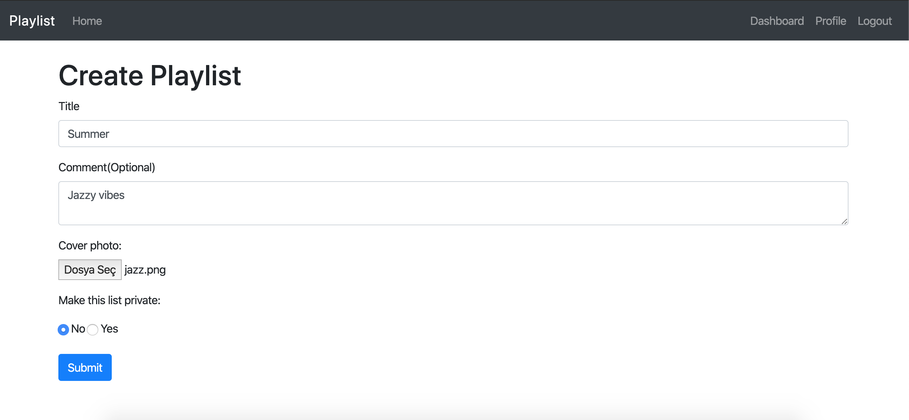
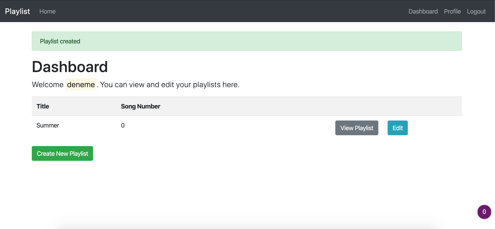
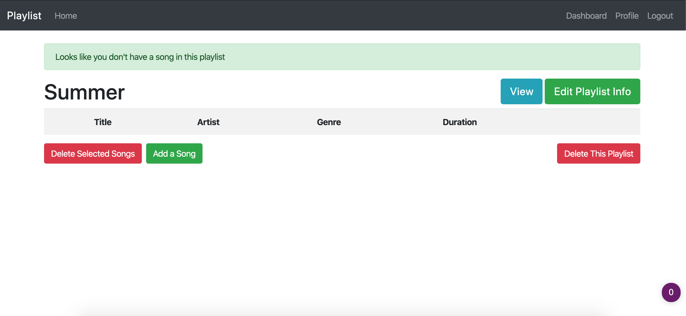
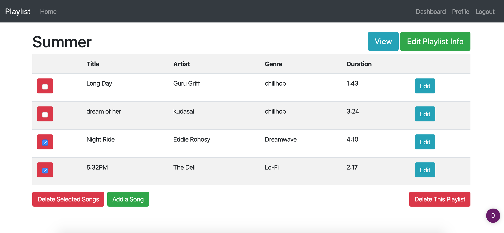
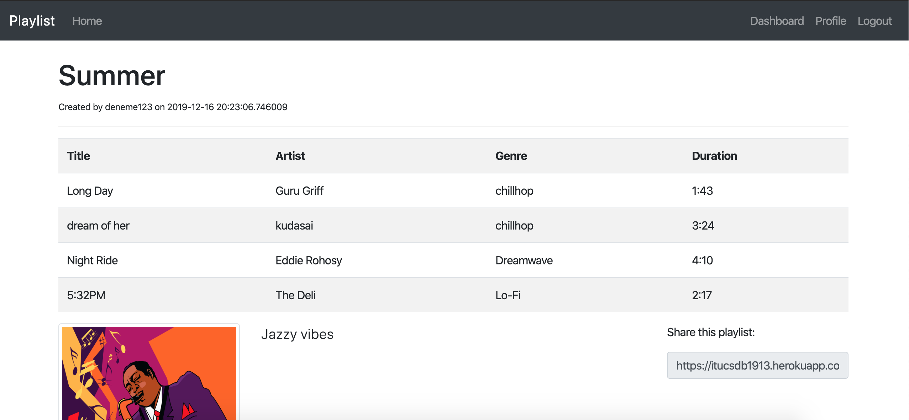
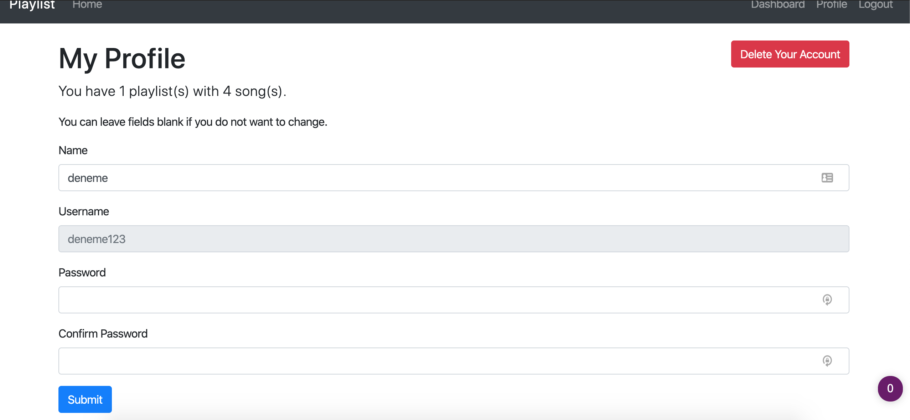

User Guide
==========

When you enter the site, you will see a page like above one. You need to register to create playlists. Also you can see last 10 playlists created at "Recently created playlists:" section.

You can create an account from register link. 

Once you login you will see dashboard page. This is where you will see all your playlists. It is empty now. Lets create one. 

Title is title of the playlist. In comment part you can describe your playlist. If you want to upload a photo for your playlist you can do that. Also if you want your playlist to be private you can select yes so others can not see.

Now our playlist has been created. We can view it and edit it. To add songs we simply click edit button. 

In this page you can edit your playlist. Lets first add a song by clicking "Add a Song" button.

.. figure:: addsong.png
	:scale: 50 %
	:alt: adding song
In this page you fill areas then click submit button to add a song. 

To delete songs from a playlist you can click checkboxes. After clicking "Delete Selected Songs" button, they will be deleted. Also you can delete this playlist with all songs in it by clicking "Delete This Playlist" button. To edit title, comment, privacy and cover photo of the playlist you should click "Edit playlist info" button. 

You can view your playlist here. Also you can share it by copying the link in "Share this playlist" field. 

In this page you can edit your password and name. If you want to change only your name, you can leave password field empty. Also you can delete your account from here. 

